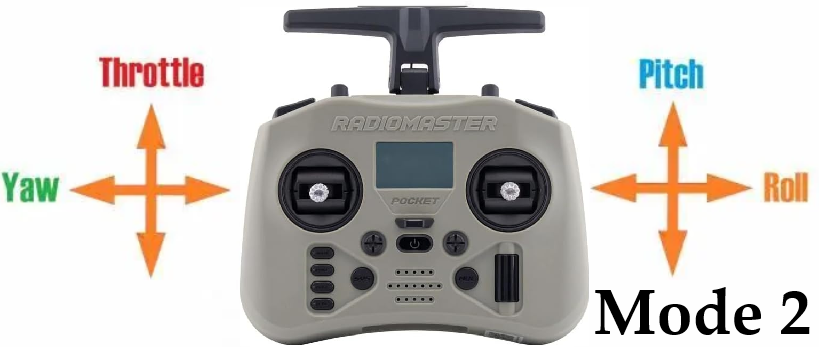

# A ROS2 application designed for the offboard control of a PX4 UAV
## Overview
This tutorial explains how to integrate **ROS2** and **PX4** to control a simulated **UAV** using velocity. An **XBOX** controller is used for user controls. The **UAV** system is simulated with either **Gazebo** or **JMAVSim**.

The primary objective is to develop a **Python** example that anyone can follow, understand, and utilize comprehensively, based on **ROS2** and **PX4**.

## YouTube
To demonstrate the project's functionality and provide some gentle guidance, a short video was published on YouTube. You can find the link below:

## The application
Essentially, the entire project consists of two nodes. 

The first node controls the **PX4** autopilot through the **Micro XRCE-DDS bridge**. Commands are sent using speed information, but the code for position control also exists in the application and can be used as is. 

The second node receives information from the XBOX controller via the Python pygame library. Communication between nodes occurs through two topics: __/offboard_velocity_cmd__ (of Twist type – used for sending velocity commands) and __/action_message__ (of UInt8 data type).

In the [xbox.py](https://github.com/dmdobrea/ROS2_offboard_control/blob/main/offboard_control/offboard_control/xbox.py) file (used to interface with Xbox controller), the variable __m3_vs_m2__ sets the mode mapping of the Xbox’s joysticks. If __m3_vs_m2 = 0__, **Mode 2** is active. In the case of __m3_vs_m2 = 1__, **Mode 3** is active. See the following figures.

  
  

This repo is based on: 
* [Jaeyoung Lim's Offboard example](https://github.com/Jaeyoung-Lim/px4-offboard) and
* [ARK Electronics example](https://github.com/ARK-Electronics/ROS2_PX4_Offboard_Example)

## Prerequisites
* **ROS2 Humble**
* **PX4 Autopilot** (the application was tested on the latest version 1.16.0 at the moment of writing this text, September 6, 2025)
* **Micro XRCE-DDS Agent**
* **px4_msgs**
* **Ubuntu 22.04**
* **Python** - tested on 3.10

## Setup Steps
All the steps needed to install and configure the various components required to support this application are outlined as follows:

### Install PX4
You only need to install **PX4** if you require the simulator, as we do in this guide. If you're working on a real **UAV** system, the **PX4 autopilot** is already installed on your drone.
Set up a **PX4** development environment on Ubuntu like this:

<html>
  <head>
$ git clone https://github.com/PX4/PX4-Autopilot.git --recursive
$ cd PX4-Autopilot/

$ bash ./PX4-Autopilot/Tools/setup/ubuntu.sh
  </head>

